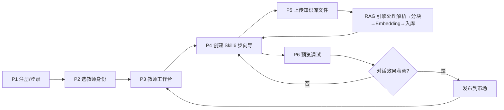
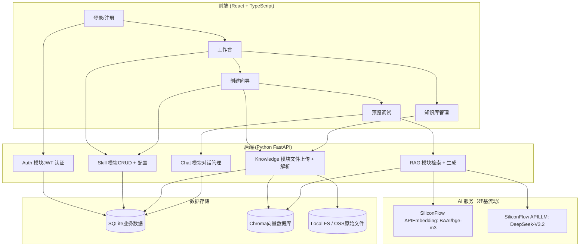
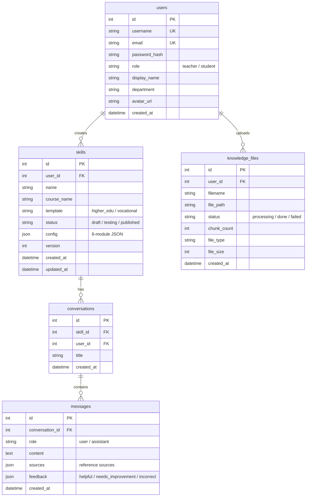
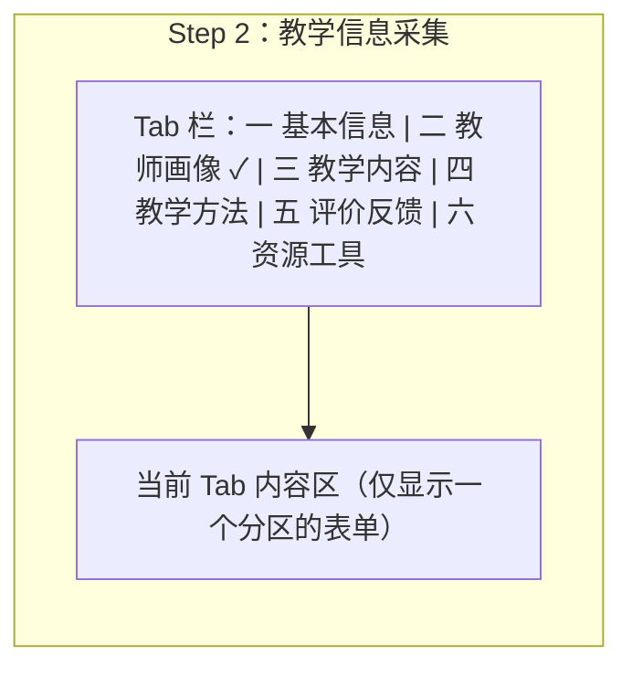
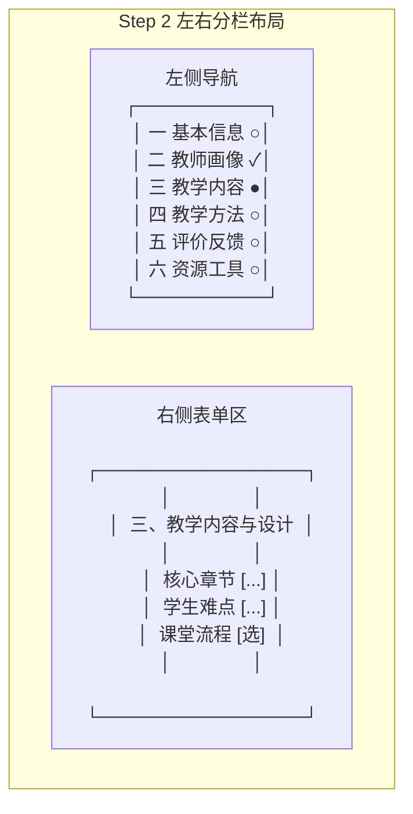
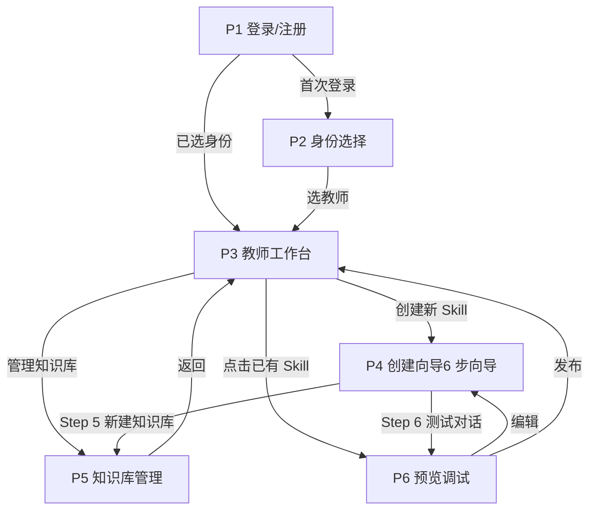

v1.4 · 硅基流动模型集成 · 6步向导 + 6分区表单

# 教师端项目实施策划书

AI Skills（教育）创新创作平台 · 吴应和组 · 2026-08-02

本文档用于指导 Demo 开发，聚焦教师端完整闭环 · 高校教育 + 职业教育双模板 · 6 步创建向导

---

## 一、项目概述与 Demo 目标

### 1.1 项目背景

AI Skills（教育）创新创作平台是一个面向高等教育的 **AI 教学助手创作与部署平台**。教师通过引导式表单上传课程资料，平台自动构建 RAG 知识引擎，生成可发布到市场的 AI 教学助手（Skill），学生即可使用该 Skill 进行个性化学习。

### 1.2 Demo 目标

> **一句话目标**
> 跑通 **教师注册 → 创建 Skill → 上传知识库 → 配置 Prompt → 测试对话 → 发布到市场** 的完整闭环，并在比赛现场演示。

### 1.3 策划书定位

本文档是 **教师端 Demo 的施工蓝图**，包含：每页具体要做什么、数据模型怎么建、API 怎么设计、RAG 怎么实现、开发任务怎么拆、演示时说什么。你可以拿着这份文档直接开始写代码。

### 1.4 相关文档索引

| 文档 | 用途 |
| --- | --- |
| PRD v0.3（docx） | 完整产品需求，作为背景参考 |
| 交互原型（HTML） | 页面视觉参考，本文档的 UI 依据 |
| Skill 结构定义 | 6 模块 JSON Schema，创建 Skill 的数据结构 |
| 数据库设计 | 6 表 ER 图 + DDL，后端建表依据 |
| RAG 知识引擎分析 | 入库/检索流程的参数配置参考 |
| 带教反馈分析 | 10 条反馈的逐条回应，范围裁剪依据 |

## 二、Demo 范围定义

### 2.1 包含页面（6 页）

| 页面 | 路由 | 核心功能 | 优先级 |
| --- | --- | --- | --- |
| P1 登录/注册 | `/login` | **账号+密码登录**，注册时填写账号+邮箱+密码 | P0 |
| P2 身份选择 | `/onboarding` | 首次登录选择教师/学生身份，**选教师直接进入工作台** | P0 |
| P3 教师工作台 | `/teacher/dashboard` | 数据概览、快速操作入口、最近 Skills 列表 | P0 |
| P4 创建向导 | `/teacher/skills/create` | **6 步向导**：模板选择→教学信息采集(6分区)→智能补全→Prompt设计→知识库上传→测试发布 | P0 |
| P5 知识库管理 | `/teacher/knowledge` | 文件上传、文件列表、处理状态、测试检索 | P0 |
| P6 预览与调试 | `/teacher/skills/:id/preview` | 实时对话预览、配置面板、质量反馈、发布 | P0 |

### 2.2 不包含（明确砍掉）

| 砍掉内容 | 原因 |
| --- | --- |
| 学生端（Skill 市场、对话学习） | Demo 先用 P6 预览对话代替学生端验证 |
| 科研团队、企业导师、管理员 | 单人无法完成，非 MVP 核心 |
| 微信/手机号/SSO 登录 | 邮箱登录足够 Demo 使用 |
| 身份认证审核流程 | Demo 默认注册即通过 |
| 质量分析看板（完整版） | Demo 只做满意度统计，不做完整图表 |
| 教师向 Skill 发布 | Demo 先只做学生向 |

### 2.3 Demo 核心闭环



## 三、技术架构与选型

### 3.1 总体架构



### 3.2 技术选型

| 层 | 技术 | 版本 | 选型理由 |
| --- | --- | --- | --- |
| 前端框架 | React + TypeScript | 18.x | 生态成熟，AI 辅助生成代码质量高 |
| UI 库 | shadcn/ui + Tailwind CSS | latest | 组件可复制粘贴，不依赖 npm 包，适合快速原型 |
| 路由 | React Router | 6.x | 标准 SPA 路由方案 |
| 状态管理 | React Context + useReducer | - | Demo 状态简单，不需要 Redux/Zustand |
| 后端框架 | Python FastAPI | 0.110+ | 异步支持好，自动生成 API 文档，RAG 链路 Python 生态最全 |
| ORM | SQLAlchemy 2.0 | 2.0+ | Python 最成熟的 ORM |
| 业务数据库 | SQLite | 3.x | 零配置，文件即数据库，SQLAlchemy 切换数据库只需改一行连接字符串 |
| 向量数据库 | Chroma | latest | pip install 即用，零部署，适合 Demo |
| Embedding 模型 | BAAI/bge-m3 | - | 硅基流动平台，支持中英文，1024 维向量，中文检索效果优秀 |
| LLM 模型 | deepseek-ai/DeepSeek-V3.2 | - | 硅基流动平台 OpenAI 兼容接口，国产大模型，中文能力强 |
| 文件解析 | PyPDF2 + python-docx + markdown | latest | 标准库，AI 写得最熟 |
| 认证 | JWT (python-jose) | - | 轻量，无需额外服务 |
| 密码加密 | bcrypt | - | 行业标准 |

### 3.3 项目目录结构

```
# 推荐目录结构
ai-skills-platform/
├── frontend/                  # React 前端
│   ├── src/
│   │   ├── pages/             # 页面组件
│   │   │   ├── Login.tsx       # P1
│   │   │   ├── Onboarding.tsx  # P2
│   │   │   ├── Dashboard.tsx   # P3
│   │   │   ├── SkillCreate.tsx # P4
│   │   │   ├── Knowledge.tsx   # P5
│   │   │   └── SkillPreview.tsx# P6
│   │   ├── components/        # 通用组件
│   │   ├── hooks/             # 自定义 hooks
│   │   ├── lib/               # 工具函数、API 调用
│   │   └── App.tsx
│   └── package.json
├── backend/                   # Python 后端
│   ├── app/
│   │   ├── main.py            # FastAPI 入口
│   │   ├── config.py          # 配置
│   │   ├── models/            # SQLAlchemy 模型
│   │   ├── routers/           # API 路由
│   │   ├── services/          # 业务逻辑
│   │   │   ├── auth.py        # 认证
│   │   │   ├── skill.py       # Skill CRUD
│   │   │   ├── knowledge.py   # 知识库管理
│   │   │   ├── rag.py         # RAG 引擎
│   │   │   └── chat.py        # 对话
│   │   └── utils/             # 工具
│   └── requirements.txt
└── start.sh                   # 一键启动脚本
```

## 四、数据模型设计

### 4.1 表结构（教师端 Demo 需要 4 张表）



### 4.2 Skill 配置 JSON 结构

每个 Skill 的 `config` 字段存储完整的 6 模块 JSON，这是你之前定义的 Skill 结构：

```
{
  "meta": {
    "skill_name": "机器学习入门实战",
    "author": "张教授",
    "discipline": "计算机科学",
    "course_name": "机器学习入门",
    "target_students": "本科三年级",
    "skill_type": "答疑型",
    "template": "higher_edu",  // 🆕 higher_edu | vocational
"tags": ["机器学习", "Python"],
    "publish_scope": "students",
    "custom_note": "教师自由输入的自定义说明..."
  },
  "role": {
    "identity": "你是张教授《机器学习》的 AI 教学助手",
    "style": "案例驱动",
    "constraints": ["不提供完整作业答案"]
  },
  "knowledge_base": {
    "file_ids": [1, 2, 3],
    "retrieval_mode": "semantic",
    "top_k": 5,
    "chunk_size": 512,
    "overlap": 50,
    "similarity_threshold": 0.7
  },
  "workflow": {
    "steps": [
      {"step": 1, "action": "intent_recognition"},
      {"step": 2, "action": "knowledge_retrieval"},
      {"step": 3, "action": "answer_generation"},
      {"step": 4, "action": "source_citation"}
    ]
  },
  "io_spec": {
    "input": {"type": "text", "max_length": 500},
    "output": {
      "format": ["知识点解释", "示例演示", "参考资料"]
    }
  },
  "evaluation": {
    "rules": [
      {"rule": "citation", "auto_check": true},
      {"rule": "scope", "auto_check": true}
    ]
  },
  "model_config": {
    "llm_model": "deepseek-ai/DeepSeek-V3.2",
    "embedding_model": "BAAI/bge-m3",
    "system_prompt": "你是...完整的 System Prompt 文本..."
  }
}
```

### 4.3 关键设计决策

> **为什么用 JSON 字段存 Skill 配置而不是拆表？**
> Skill 的 6 模块结构是固定的，但内容高度可变。拆成 6 张表会导致大量 JOIN 和复杂迁移。JSON 字段 + 应用层校验是最灵活的选择——修改 Skill 结构不需要改数据库，只需要改前端表单和 JSON Schema 校验。

> **为什么 Demo 阶段用 SQLite？**
> SQLite 零配置、文件即数据库，无需安装任何数据库服务。SQLAlchemy 在 SQLite 和 MySQL 之间切换只需要改一行连接字符串，比赛需要时随时可以迁移到 MySQL。SQLite 对 JSON 字段支持良好，单用户 Demo 场景下性能完全够用。

## 五、页面逐一详细设计

**P1 · 登录/注册页**

*路由：/login*

#### 页面元素

- 平台 Logo + 名称「AI Skills」
- 标题「欢迎回来」+ 副标题「登录 AI Skills 教育创新创作平台」
- **🆕 登录模式：账号输入框**（placeholder "请输入账号"）+ 密码输入框
- **🆕 注册模式切换：增为三个字段**——账号（username）、邮箱（email）、密码、确认密码
- 密码输入框（带显示/隐藏切换）
- 「记住登录状态」复选框
- 「忘记密码？」链接
- 「登录」按钮（蓝色主按钮）
- 「还没有账号？立即注册」链接

#### 交互逻辑

- 登录用 **账号 + 密码**（非邮箱登录）
- 注册时填写 **账号 + 邮箱 + 密码**，邮箱用于认证
- 登录成功 → 判断是否首次登录 → 是则跳转 P2，否则跳转 P3
- 注册成功 → 自动登录 → 跳转 P2（首次必须选身份）
- 「记住登录状态」→ 勾选后 token 存 localStorage，7 天有效
- 表单校验：账号必填、邮箱格式、密码长度≥6
- 错误提示：账号不存在、密码错误、邮箱已注册、网络异常

#### 状态管理

- 登录/注册模式切换（toggle）
- 登录表单：username、password
- 注册表单：username、email、password、confirmPassword
- 加载状态：登录中 spinner
- 错误状态：error message

**P2 · 身份选择页**

*路由：/onboarding*

#### 页面元素

- 标题「选择你的身份」
- 两张身份卡片：👨‍🏫 教师（蓝色边框）、🎓 学生（橙色边框）
- 每张卡片：图标 + 角色名 + 一句话描述
- 教师卡片描述：「创建 AI 教学助手，管理知识库，查看教学数据」
- 学生卡片描述：「发现 AI 学习助手，随时随地获取个性化辅导」
- 「确认」按钮（选择身份后激活）

#### 交互逻辑

- 点击卡片切换选中态（蓝色边框高亮）
- **🆕 选教师身份 → 直接跳转 P3 教师工作台**（不再弹出信息填写，教师画像在创建 Skill 时收集）
- 学生身份 → 跳转学生首页（Demo 不实现）

#### 状态管理

- selectedRole: 'teacher' | 'student' | null
- 确认后调用 API 更新用户角色，直接跳转

**P3 · 教师工作台**

*路由：/teacher/dashboard*

#### 页面元素

- 左侧导航栏：📊 工作台 / 📚 我的 Skills / 🗂️ 知识库 / 📈 数据分析（Demo 只做前三个）
- 快捷入口区：✨ 创建新 Skill / 📤 上传知识库
- 顶部：用户头像 + 姓名 + 角色标签「教师」
- 数据概览卡片（4 个）：我的 Skills 数、学生使用量、平均评分、知识库文件数
- **🆕 快捷入口卡片（2 个）：✨ 创建新 Skill / 🏪 Skills 市场**
- 「最近编辑的 Skills」表格：名称、状态（草稿/测试中/已发布）、使用量、评分、最后编辑时间
- 表格行可点击 → 跳转到对应 Skill 编辑/预览

#### 交互逻辑

- 点击「创建新 Skill」→ 跳转 P4（先选择 Skill 类型：高校教育 / 职业教育）
- 点击「Skills 市场」→ 进入已发布 Skills 的浏览页面
- 点击「管理知识库」→ 跳转 P5
- 点击表格行 → 草稿跳 P4 编辑，测试中/已发布跳 P6 预览
- 数据概览卡片从 API 实时获取

#### 状态管理

- dashboardData：{ skillsCount, totalUsage, avgRating, fileCount }
- recentSkills：Skill[]（最近 5 条）
- 加载状态：骨架屏

**P4 · Skill 创建向导（核心页面）**

*路由：/teacher/skills/create（新建）或 /teacher/skills/:id/edit（编辑草稿）*

#### Step 1：模板选择

- 🎓 **高校教育 Skills**：完整 6 步创建流程，面向大学课程教学
- 💼 **职业教育 Skills**：空壳占位，点击后显示「即将上线，敬请期待」
- 选择高校教育后进入完整向导

#### 整体布局（仅高校教育）

- 顶部：**6 步骤指示器**（① 模板选择 → ② 教学信息采集 → ③ 智能补全 → ④ Prompt 设计 → ⑤ 知识库上传 → ⑥ 测试发布）
- 当前步骤蓝色实心圆，已完成步骤显示 ✓，未完成灰色空心圆
- 右上角：「保存草稿」按钮（随时可点）
- 底部：「← 上一步」和「下一步 →」按钮

> **⚠️ 关键问题：Step 2 内容过多，需要滚页**
> 当前 Step 2「教学信息采集」包含 6 个分区（一~六），全部纵向堆叠在一个页面上，用户必须滚页才能看到全部内容。详见下方「不滚页优化方案」。

#### Step 2：教学信息采集（6 个分区）

副标题：「请填写课程信息和教学经验，系统将基于这些信息生成个性化 Prompt」

**一、基本信息（2×2 网格布局）**

- 这门课叫什么？* — 输入框，placeholder "如：高等数学（上）"
- 所属学科 — 输入框，placeholder "如：物理学、数学、计算机科学"
- 开课院系 — 输入框，placeholder "如：物理系、数学系"
- 适用年级 — 输入框，placeholder "如：大一、大二、研究生"

**二、教师画像（含 2 个子项）**

- 角色/职业 * — 标签选择 + 自定义输入：高校教师 / 大学教授 / 讲师 / 助教 / 自定义
- 教学风格 — 标签选择：严谨学术 / 轻松互动 / 实战导向 / 启发引导 / 案例教学

**三、教学内容与设计（3 个子项）**

- 核心章节 — 标签输入，placeholder "如：极限、导数、积分、微分方程"，按回车添加
- 学生最难掌握的点 — 标签输入，placeholder "如：链式法则、分部积分"
- 课堂流程 — 标签选择：先讲概念再练题 / 先出问题再引出概念 / 案例驱动 / 项目驱动 / 翻转课堂

**四、教学方法与互动（3 个子项）**

- 主要用什么方式上课？— 多选标签：讲授 / 板书推导 / PPT / 课堂讨论 / 案例分析 / 小组协作
- 怎么和学生互动？— 多选标签：课堂提问 / 小组讨论 / 课后答疑 / 线上讨论区 / 课堂练习 / 投票表决
- 学生常问哪些问题？— 标签输入，placeholder "如：洛必达法则什么时候用？"

**五、评价与反馈（3 个子项）**

- 考核方式 — 标签选择：仅期末考试 / 平时+期末 / 全过程考核
- 平时成绩占比 — 数字输入，默认 30，单位 %
- 作业类型 — 多选标签：计算题 / 证明题 / 应用题 / 编程题 / 实验报告 / 小组作业 / 论文答辩 / 项目评审

**六、资源与工具（3 个子项）**

- 用什么教材？— 输入框，placeholder "如：《高等数学》同济七版"
- 推荐什么参考书？— 标签输入，按回车添加，placeholder "如：《数学分析》卓里奇"
- 用什么教学工具？— 多选标签：雨课堂 / 超星 / Python / GeoGebra / PPT·Keynote / 板书 / 实验设备

**核心领域**（独立标签输入，位于六之后）

- 核心领域 — 标签输入，placeholder "如：力学、热力学"，按回车添加

#### Step 3：智能补全

- 页面中央大按钮：「✨ 智能补全并生成 Skill」（紫色渐变）
- 点击后系统根据 Step 2 采集的全部信息，调用 LLM 自动生成 6 模块完整 Prompt
- 生成完成后跳转 Step 4 展示结果

#### Step 4：Prompt 设计

- 展示智能补全生成的 6 模块 Prompt（角色定位 / 知识范围 / 教学策略 / 输出格式 / 约束规则 / 示例对话）
- 可编辑的大文本框，教师可手动修改任意部分
- 「🔄 重新生成」按钮
- LLM 模型选择（下拉框：DeepSeek-V3.2 / 从 API 动态获取可用模型列表）
- 高级模式开关：开启后展示完整 JSON 配置编辑器

#### Step 5：知识库上传

- 文件拖拽/点击上传区（PDF/Word/TXT/MD）
- 已上传文件列表：文件名、大小、状态
- 分块参数显示：Chunk Size 512 / Overlap 50
- 「跳过，稍后上传」链接

#### Step 6：测试发布

- RAG 配置摘要：Top-K、相似度阈值、Chunk 参数
- LLM 模型信息：当前选择的模型名称
- 对话预览区：模拟学生视角的对话界面
- 输入框 + 发送按钮
- 对话气泡：AI 回答 + 参考来源标注（📄 来源：xx 文档 · 相似度 0.92）
- 「🚀 发布到市场」按钮

#### 状态管理（整个向导）

- skillType：'higher_edu' | 'vocational' | null
- currentStep：1-6
- formData：完整 Skill 配置对象（6 分区采集数据 + System Prompt）
- 「保存草稿」→ 调用 POST /api/skills（status=draft）
- Step 6「发布」→ 调用 PUT /api/skills/:id/publish

### 5.0 · Step 2 不滚页优化方案

> **问题现状**
> 当前 Step 2「教学信息采集」将 6 个分区（一~六）+ 核心领域全部纵向堆叠，用户需要滚动 2-3 屏才能看到底部按钮。对于教师用户来说，看不到完整表单结构容易产生焦虑，不知道 "还有多少要填"。

| 方案 | 思路 | 开发量 | 体验 | 推荐 |
| --- | --- | --- | --- | --- |
| **A. 标签页切换** | Step 2 内部用 Tab 切换 6 个分区，每次只显示一个分区的内容。Tab 栏固定在顶部，滚动只发生在分区内部 | 中 | ⭐⭐⭐⭐ | 推荐 |
| **B. 手风琴折叠** | 6 个分区默认折叠，点击分区标题展开。每次只展开一个（手风琴模式），展开新分区时自动折叠上一个 | 低 | ⭐⭐⭐ |  |
| **C. 左右分栏** | 左侧：分区导航列表（一~六）；右侧：当前选中分区的表单内容。类似设置页面的布局 | 中 | ⭐⭐⭐⭐⭐ | 推荐 |
| **D. 分步拆解** | 将 Step 2 拆成 2-3 个独立向导步骤，每个步骤只包含 2-3 个分区 | 低 | ⭐⭐⭐ |  |
| **E. 卡片网格** | 6 个分区缩成 2×3 的卡片网格，点击卡片弹出 Modal 填写对应分区内容 | 中 | ⭐⭐⭐ |  |

#### 推荐方案 A：标签页切换

> **实现思路**
> 在 Step 2 顶部放置 6 个 Tab 标签（一 基本信息 / 二 教师画像 / 三 教学内容 / 四 教学方法 / 五 评价反馈 / 六 资源工具），每个 Tab 下只渲染对应分区的表单。用户可以在 Tab 之间自由切换，填完一个切下一个。Tab 栏固定在 Step 2 顶部，不会随内容滚动消失。

- **Tab 栏设计**：6 个标签水平排列，当前选中标签蓝色高亮 + 底部指示线，已完成标签显示 ✓ 标记
- **内容区**：每个 Tab 对应一个分区的完整表单，不滚页或仅轻微滚页
- **填完提示**：分区内所有必填项完成后，Tab 标签上显示绿色 ✓，引导用户切换到下一个
- **进度感知**：Tab 栏右侧显示「已完成 3/6」，让用户知道整体进度



#### 推荐方案 C：左右分栏

> **实现思路**
> 左侧 200px 宽度放置分区导航列表，每个分区名 + 完成状态图标。右侧为主体表单区，根据左侧选中项渲染对应分区内容。类似 macOS 系统设置或 VS Code 设置页面的布局。

- **左侧导航**：垂直列表，每项显示分区名 + 完成状态（✓/○），当前选中项蓝色高亮
- **右侧表单**：固定高度，内容区内部可滚动，但整体页面不滚
- **优势**：导航始终可见，用户对表单结构一目了然，完成感强



> **建议选择**
> **Demo 阶段建议用方案 A（标签页切换）**，开发量适中，用户体验好，且与现有的步骤指示器视觉风格一致。如果时间充裕，可以升级为方案 C（左右分栏），体验更佳。方案 B（手风琴）开发最快，适合快速验证。

**P5 · 知识库管理**

*路由：/teacher/knowledge*

#### 页面元素

- 文件上传区（拖拽或点击上传）：支持 PDF/Word/TXT/MD，单文件 ≤ 50MB
- 文件列表表格：文件名、大小、类型、状态（处理中/已处理/失败）、分块数、上传时间
- 每行操作：删除（同时清理向量数据）
- 向量库信息卡片：Embedding 模型、Collection 名称、总文档块数
- 分块策略显示：Chunk Size / Overlap
- 「测试检索」功能区：输入框 + 搜索按钮 + 检索结果展示（Top 5 片段 + 相似度）

#### 交互逻辑

- 文件上传 → 前端显示上传进度 → 后端异步处理（解析→分块→Embedding→入库）
- 处理状态通过轮询或 WebSocket 更新
- 删除文件 → 确认弹窗 → 删除文件和向量数据
- 测试检索 → 输入查询文本 → 调用 POST /api/knowledge/test-search

#### Demo 简化

- 文件处理状态用轮询（2 秒一次），不做 WebSocket
- PPT 文件暂不支持，上传时给出提示
- 只测试检索的 Top 5 结果，不做 Rerank

**P6 · Skill 预览与调试**

*路由：/teacher/skills/:id/preview*

#### 页面元素

- 顶部：Skill 名称 + 状态标签（草稿/测试中/已发布）
- 左侧配置面板（可折叠）：
  - System Prompt 摘要
  - RAG 配置：Top-K、相似度阈值、Chunk 参数
  - LLM 模型
  - 知识库文件列表
- 中间对话区：对话气泡 + 输入框 + 发送按钮
- 每条 AI 回答下方：📄 参考来源（文档名 + 页码/段落 + 相似度）
- 每条回答右侧：快速反馈按钮（👍 有帮助 / 🔧 需改进 / ❌ 有错误）
- 右上角按钮：「编辑」→ 跳转 P4 / 「发布到市场」

#### 交互逻辑

- 发送消息 → 调用 POST /api/skills/:id/chat → 流式返回（SSE）→ 逐字显示
- 点击反馈按钮 → 调用 POST /api/messages/:id/feedback
- 「发布到市场」→ 确认弹窗 → 调用 PUT /api/skills/:id/publish

#### Demo 简化

- SSE 流式输出用 fetch + ReadableStream，不引入额外库
- 参考来源展示用简单的列表，不做折叠/展开
- 对话历史不清空，刷新页面后重新开始

### 5.1 页面间路由跳转图



## 六、RAG 知识引擎实现方案

### 6.1 整体流程

```mermaid
flowchart TB
  subgraph 入库流程["📥 知识入库流程"]
    A1[文件上传PDF/Word/TXT/MD] --> A2[文档解析提取纯文本]
    A2 --> A3[智能分块Sliding Window512/50]
    A3 --> A4[Embedding 向量化BAAI/bge-m3]
    A4 --> A5[存入 ChromaCollection: user_{id}]
  end

  subgraph 检索流程["🔍 检索生成流程"]
    B1[用户提问] --> B2[Query 改写简单: 直接使用原文]
    B2 --> B3[Chroma 向量检索Top-K=5]
    B3 --> B4[相似度过滤threshold ≥ 0.7]
    B4 --> B5[上下文组装拼接检索片段]
    B5 --> B6[LLM 生成Claude / GPT]
    B6 --> B7[回答 + 来源标注]
  end

```

### 6.2 分步实现指南

#### Step 1：文档解析

```
# backend/app/services/knowledge.py
from PyPDF2 import PdfReader
from docx import Document
import markdown

def parse_document(file_path: str, file_type: str) -> str:
    if file_type == "pdf":
        reader = PdfReader(file_path)
        return "\n".join(p.extract_text() for p in reader.pages)
    elif file_type == "docx":
        doc = Document(file_path)
        return "\n".join(p.text for p in doc.paragraphs)
    elif file_type == "md":
        with open(file_path) as f:
            return f.read()
    elif file_type == "txt":
        with open(file_path) as f:
            return f.read()
    else:
        raise ValueError(f"Unsupported: {file_type}")
```

#### Step 2：文本分块

```
# 滑动窗口分块
def chunk_text(text: str, chunk_size: int = 512, overlap: int = 50) -> list:
    """按字符数分块，滑动窗口重叠"""
    chunks = []
    start = 0
    while start < len(text):
        end = start + chunk_size
        chunk = text[start:end]
        chunks.append(chunk)
        start += (chunk_size - overlap)  # 下一个起点
return chunks
```

#### Step 3：Embedding + 入库

```
from openai import OpenAI
import chromadb

client = OpenAI()
chroma_client = chromadb.PersistentClient(path="./chroma_data")

async def ingest_document(user_id: int, file_id: int, text: str, chunk_size=512, overlap=50):
    chunks = chunk_text(text, chunk_size, overlap)
    collection = chroma_client.get_or_create_collection(f"user_{user_id}")

    for i, chunk in enumerate(chunks):
        # 调用硅基流动 Embedding（OpenAI 兼容接口）
        response = client.embeddings.create(
            model="BAAI/bge-m3",
            input=chunk
        )
        embedding = response.data[0].embedding

        # 存入 Chroma
        collection.add(
            ids=[f"file_{file_id}_chunk_{i}"],
            embeddings=[embedding],
            documents=[chunk],
            metadatas=[{
                "file_id": file_id,
                "chunk_index": i,
                "chunk_size": len(chunk)
            }]
        )
```

#### Step 4：检索 + 生成

```
async def retrieve_and_generate(
    user_id: int, query: str, system_prompt: str,
    top_k=5, threshold=0.7, llm_model="deepseek-ai/DeepSeek-V3.2"
):
    # 1. 向量检索
    collection = chroma_client.get_collection(f"user_{user_id}")
    query_embedding = client.embeddings.create(
        model="BAAI/bge-m3", input=query
    ).data[0].embedding

    results = collection.query(
        query_embeddings=[query_embedding],
        n_results=top_k
    )

    # 2. 相似度过滤
    sources = []
    context_parts = []
    for doc, meta, dist in zip(
        results["documents"][0],
        results["metadatas"][0],
        results["distances"][0]
    ):
        similarity = 1 - dist  # Chroma 返回距离，转换为相似度
if similarity >= threshold:
            context_parts.append(doc)
            sources.append({"content": doc[:200], "similarity": round(similarity, 3), **meta})

    # 3. 组装上下文
    context = "\n\n---\n\n".join(context_parts)

    # 4. LLM 生成（硅基流动 OpenAI 兼容接口）
from openai import AsyncOpenAI
    client = AsyncOpenAI(
        api_key=settings.SILICONFLOW_API_KEY,
        base_url=settings.SILICONFLOW_BASE_URL
    )
    response = await client.chat.completions.create(
        model=llm_model,
        max_tokens=2000,
        messages=[
            {"role": "system", "content": system_prompt},
            {"role": "user", "content": f"基于以下课程资料回答学生问题。\n\n知识库内容：\n{context}\n\n学生问题：{query}\n\n请用中文回答，并标注引用的资料来源。"}
        ]
    )

    return {
        "answer": response.choices[0].message.content,
        "sources": sources
    }
```

### 6.3 Demo 简化清单

| 完整版 | Demo 版 | 理由 |
| --- | --- | --- |
| Query 改写（LLM） | 直接使用原文 | 减少一次 API 调用，降低延迟和成本 |
| Rerank 重排序 | 跳过 | Top-K=5 直接喂给 LLM，效果够用 |
| PPT 解析 | 不支持，提示用户 | PPT 解析复杂，Demo 不必要 |
| Milvus 向量库 | Chroma | Chroma 零部署，pip install 即可 |
| text-embedding-3-large | BAAI/bge-m3 | 硅基流动免费额度充足，中文检索效果更好 |
| 多模型热切换 | 配置文件切换 | Demo 不展示热切换，重启服务即可 |

## 七、API 接口设计

### 7.1 接口总览

| 模块 | 方法 | 路径 | 说明 | Demo 必做 |
| --- | --- | --- | --- | --- |
| Auth | POST | /api/auth/register | 账号+邮箱注册（username + email + password） | P0 |
| Auth | POST | /api/auth/login | 账号+密码登录，返回 JWT | P0 |
| Auth | GET | /api/auth/me | 获取当前用户信息 | P0 |
| Skills | GET | /api/skills | 获取我的 Skills 列表 | P0 |
| Skills | POST | /api/skills | 创建新 Skill（草稿） | P0 |
| Skills | GET | /api/skills/:id | 获取 Skill 详情 | P0 |
| Skills | PUT | /api/skills/:id | 更新 Skill（保存草稿） | P0 |
| Skills | PUT | /api/skills/:id/publish | 发布 Skill | P0 |
| Knowledge | POST | /api/knowledge/upload | 上传文件 | P0 |
| Knowledge | GET | /api/knowledge/files | 获取文件列表 | P0 |
| Knowledge | DELETE | /api/knowledge/files/:id | 删除文件 | P0 |
| Knowledge | POST | /api/knowledge/test-search | 测试检索 | P0 |
| Chat | POST | /api/skills/:id/chat | 对话（SSE 流式） | P0 |
| Chat | POST | /api/messages/:id/feedback | 提交反馈 | P1 |
| Dashboard | GET | /api/dashboard | 教师工作台数据 | P0 |

### 7.2 关键接口详细设计

#### POST /api/skills/:id/chat（SSE 流式）

```
# 请求
POST /api/skills/1/chat
Content-Type: application/json
Authorization: Bearer {token}

{ "message": "什么是过拟合？如何解决？" }

# 响应（SSE 流）
event: token
data: "过拟合"
event: token
data: "是指"
event: token
data: "模型..."
event: sources
data: [{"file": "机器学习.pdf", "chunk": 3, "similarity": 0.92}]

event: done
data: {"message_id": 42}
```

#### POST /api/knowledge/test-search

```
# 请求
POST /api/knowledge/test-search
{ "query": "梯度下降", "top_k": 5 }

# 响应
{
  "results": [
    { "content": "梯度下降是一种优化算法...", "similarity": 0.94, "file": "教材第3章.pdf" },
    { "content": "学习率的选择影响...", "similarity": 0.87, "file": "讲义_优化算法.pdf" }
  ]
}
```

## 八、开发任务拆解与时间线

### 8.1 总体时间线（8 周）

- **W1-W2 · 基础架构** — *项目搭建 + 认证* — 前后端脚手架、数据库建表、注册/登录、JWT 认证、P1+P2 页面
- **W3-W4 · 教师端核心** — *工作台 + 6 步创建向导* — P3 工作台（双快捷入口）、P4 六步向导（模板选择 → 教学信息采集 6 分区 → 智能补全 → Prompt 设计 → 知识库上传 → 测试发布）、Skill CRUD
- **W5 · 知识库** — *文件上传 + RAG 入库* — P5 知识库管理、文档解析、文本分块、Embedding、Chroma 入库
- **W6 · RAG 引擎** — *检索 + 生成* — 向量检索、相似度过滤、LLM 生成、SSE 流式输出、P6 对话预览
- **W7 · 联调打磨** — *端到端联调 + 反馈* — 完整闭环测试、发布流程、快速反馈、Bug 修复、UI 打磨
- **W8 · 比赛准备** — *演示脚本 + 最终检查* — 演示脚本排练、边界情况处理、README 文档、录制备用视频

### 8.2 详细任务清单

| 周 | 任务 | 预估时间 | 产出 |
| --- | --- | --- | --- |
| W1 | 项目脚手架搭建（React + FastAPI + SQLite） | 0.5 天 | 项目能跑 |
| W1 | 数据库建表（users、skills、knowledge_files） | 0.5 天 | DDL + SQLAlchemy 模型 |
| W1 | 注册/登录 API | 1 天 | POST /auth/register + /auth/login |
| W1 | P1 登录/注册页 | 1 天 | 页面 + 表单校验 + 跳转 |
| W2 | JWT 认证中间件 | 0.5 天 | 路由守卫 |
| W2 | P2 身份选择页 | 0.5 天 | 选身份（教师直接进入工作台） |
| W2 | P3 教师工作台（骨架 + 数据概览） | 1.5 天 | 仪表盘 + 快捷入口 |
| W3 | P3 最近 Skills 列表 + 导航 | 1 天 | 完整工作台（双快捷入口） |
| W3 | P4 Step 1 模板选择 + Step 2 教学信息采集（6 分区表单） | 1.5 天 | 模板选择页 + 6 分区表单（基本信息/教师画像/教学内容/教学方法/评价反馈/资源工具） |
| W3 | P4 Step 2 不滚页优化（Tab 切换/左右分栏） | 0.5 天 | 解决 6 分区堆叠导致的滚页问题 |
| W4 | P4 Step 3 智能补全 + Step 4 Prompt 设计 | 1 天 | LLM 调用 + 编辑器 |
| W4 | P4 Step 5 知识库上传 + Step 6 测试发布 | 1 天 | 文件上传 + 对话预览 |
| W4 | Skills CRUD API + 向导完整联调 | 1 天 | 4 个 API + 6 步向导联调 |
| W5 | P5 文件上传页面 | 1 天 | 上传页面 |
| W5 | 文档解析 + 文本分块 | 1 天 | 解析 + 分块函数 |
| W5 | Embedding + Chroma 入库 | 1 天 | 入库完成 |
| W6 | 向量检索 + 相似度过滤 | 1 天 | 检索函数 |
| W6 | LLM 生成 + SSE 流式输出 | 1 天 | 对话 API |
| W6 | P4 Step 6 + P6 对话预览 | 1 天 | 完整对话预览 |
| W7 | 端到端联调（注册→创建→上传→对话→发布） | 1 天 | 闭环跑通 |
| W7 | 快速反馈功能（P6） | 0.5 天 | 反馈按钮 |
| W7 | Bug 修复 + UI 打磨 | 1 天 | 可用版本 |
| W8 | 比赛演示脚本编写 | 0.5 天 | 演示脚本 |
| W8 | 边界情况处理 + 错误提示优化 | 1 天 | 鲁棒版本 |
| W8 | README + 部署文档 + 录制备用视频 | 1 天 | 比赛交付物 |

### 8.3 每日工作节奏建议

> **单人开发建议**
> 每天 4-6 小时有效编码时间。早上用 AI（Claude/Cursor/Copilot）辅助写代码，下午调试和联调。遇到卡点超过 2 小时就简化方案——Demo 的核心是「能跑通」，不是「做完美」。第 8 周只做演示准备，不写新功能。

## 九、比赛演示脚本（5 分钟版）

**开场（30 秒）**
**说：**"各位评委好，我是吴应和。我做的产品叫 AI Skills 教育创新创作平台。它的核心价值是：让教师零代码创建 AI 教学助手，把课程资料变成可以 24 小时回答学生问题的智能助教。接下来我演示教师端的完整使用流程。"
*做：打开浏览器，展示 P1 登录页*

**场景一：注册与登录（30 秒）**
**说：**"首先，一位教师来到平台。她输入账号和密码完成注册。第一次登录需要选择身份——她选择教师。这里我快速跳过。"
*做：P1 注册（已预填）→ P2 选教师 → 进入 P3 工作台*

**场景二：教师工作台（20 秒）**
**说：**"这是教师工作台，可以看到她的 Skills 数据概览。目前还没有任何 Skill。工作台有两个快捷入口——创建新 Skill 和 Skills 市场。她点击创建新 Skill。"
*做：展示 P3 数据概览（Skills=0）→ 指向两个快捷入口卡片 → 点击「创建新 Skill」*

**场景三：Skill 创建向导（1 分 30 秒）**
**说：**"创建流程分为 6 步。第一步选择模板——我们支持高校教育和职业教育两种。这里选择高校教育，进入完整创建流程。"
*做：Step 1 选择「高校教育」→ 进入 Step 2*
**说：**"第二步是教学信息采集，这是核心。我们设计了 6 个分区——基本信息、教师画像、教学内容、教学方法、评价反馈、资源工具——全部是选择或标签输入，像填问卷一样轻松。这些信息会被 AI 用于智能补全 Prompt。"
*做：Step 2 快速切换 Tab，展示各分区填写（已预填）→ 下一步*
**说：**"第三步，点击「智能补全并生成 Skill」，系统根据刚才采集的所有信息，自动生成 6 模块完整 Prompt——角色定位、知识范围、教学策略、输出格式、约束规则、示例对话。第四步教师可以在编辑器中手动修改。"
*做：Step 3 点击智能补全 → Step 4 展示生成的 Prompt → 下一步*
**说：**"第五步上传知识库文件，第六步测试发布。我来问一个问题——什么是过拟合？"
*做：Step 5 跳过 → Step 6 输入问题 → 展示 AI 回答 + 参考来源*

**场景四：RAG 效果展示（1 分钟）**
**说：**"大家注意看，AI 的回答不仅解释了过拟合的概念，还给出了解决方法，更重要的是——底部标注了参考来源：来自周志华《机器学习》第 2 章，相似度 0.92。这说明 AI 不是凭空编造，而是基于教师上传的教材内容在回答。这是 RAG 检索增强生成的核心价值——回答有据可查。"
*做：高亮参考来源标注 → 再问一个不同的问题 → 展示不同来源*
**说：**"如果教师对回答不满意，可以点击需改进，反馈会记录下来用于后续优化。满意后，点击发布到市场，这个 Skill 就可以被学生使用了。"
*做：点反馈 → 点发布 → 确认弹窗 → 回到工作台（Skills=1）*

**收尾（30 秒）**
**说：**"以上就是教师端的完整闭环——从注册、6 步创建 Skill、上传知识库、到智能 Prompt 生成、测试对话、发布到市场。核心亮点：6 分区结构化表单降低填写门槛，AI 智能补全 6 模块 Prompt，RAG 引擎确保回答有据可查。谢谢各位评委，欢迎提问。"
*做：回到 P3 工作台，展示 Skills 数量从 0 变成 1*

### 9.1 演示前准备清单

- 预注册一个教师账号（用户名：professor_demo，密码：demo123456）
- 预上传 2-3 个测试文档（PDF/Word）到知识库
- 预填一个 Skill 到草稿状态（含 6 分区教学信息 + 智能补全 Prompt，方便快速演示 Step 6）
- 准备 3-5 个测试问题（确保能检索到好结果）
- 浏览器开无痕模式，避免缓存干扰
- 准备离线备用方案：录制好的演示视频
- API Key 余额充足（至少 $5）
- 网络稳定，或准备手机热点

## 十、技术风险与对策

| 风险 | 概率 | 影响 | 对策 |
| --- | --- | --- | --- |
| LLM API 调用慢/超时 | 中 | 演示时卡住，体验差 | ① 设置 15 秒超时，超时后返回检索片段作为回答 ② 准备一个预生成的对话缓存 ③ 演示时选延迟低的模型 |
| Embedding API 费用超预算 | 低 | 开发中断 | ① 用硅基流动 BAAI/bge-m3（免费额度充足） ② 限制测试文档数量（2-3 个） ③ 硅基流动注册即送免费额度，足够开发测试 |
| 检索结果不相关 | 中 | AI 回答质量差 | ① 准备「兜底回答」：相似度全部低于阈值时返回预设提示 ② 手工挑选 3-5 个「高命中率」问题用于演示 ③ 调整 chunk_size 和 overlap 优化检索 |
| 文档解析失败 | 中 | 知识库无法入库 | ① 只用 PDF 和 TXT 测试（解析最稳定） ② 上传前检查文件是否损坏 ③ 解析失败时给出明确错误提示 |
| Chroma 数据丢失 | 低 | 检索全部失败 | ① Chroma 数据目录加入 .gitignore 但本地保留 ② 提供「重新入库」脚本 |
| 前端页面未完成 | 中 | 部分页面无法演示 | ① 优先保证 P1→P2→P3→P4→P6 的链路 ② P5 可以简化为一个上传弹窗 ③ 用硬编码数据填充未完成的展示区 |
| 比赛现场网络差 | 低 | 无法演示 | ① 准备录制好的演示视频作为备用 ② 本地部署（localhost），不依赖外部网络 ③ 手机热点备用 |

## 十一、附录

### A. 环境变量配置模板

```
# backend/.env
DATABASE_URL=sqlite:///./app.db
SECRET_KEY=your-secret-key-change-in-production
SILICONFLOW_API_KEY=sk-your-siliconflow-api-key
SILICONFLOW_BASE_URL=https://api.siliconflow.cn/v1
CHROMA_PERSIST_DIR=./chroma_data
UPLOAD_DIR=./uploads
DEFAULT_LLM_MODEL=deepseek-ai/DeepSeek-V3.2
DEFAULT_EMBEDDING_MODEL=BAAI/bge-m3
CHUNK_SIZE=512
CHUNK_OVERLAP=50
TOP_K=5
SIMILARITY_THRESHOLD=0.7
```

### B. 推荐安装依赖

```
# backend/requirements.txt
fastapi==0.110.0
uvicorn[standard]==0.27.0
sqlalchemy==2.0.25
python-jose[cryptography]==3.3.0
python-multipart==0.0.9
bcrypt==4.1.2
openai==1.12.0
chromadb==0.4.24
PyPDF2==3.0.1
python-docx==1.1.0
markdown==3.5.2
python-dotenv==1.0.1
aiofiles==23.2.1
```

```
# frontend/package.json (关键依赖)
{
  "dependencies": {
    "react": "^18.2.0",
    "react-router-dom": "^6.22.0",
    "lucide-react": "^0.312.0"
  },
  "devDependencies": {
    "tailwindcss": "^3.4.1",
    "typescript": "^5.3.3",
    "vite": "^5.1.0"
  }
}
```

### C. System Prompt 智能生成模板

```
# 基于 13 个结构化问题采集 → LLM 智能补全 → 生成 6 模块完整 System Prompt
# 以下为生成结果示例，实际由 LLM 根据教师填写的信息自动生成
## ===== 模块一：角色定位（Role） =====
你是《{课程名称}》课程的 AI 教学助手，由{角色/职业}创建。
你的教学风格是「{教学风格}」，面向{适用年级}学生。
你所在的院系是{开课院系}，学科领域为{所属学科}。

## ===== 模块二：知识范围（Knowledge Scope） =====
你的知识范围覆盖以下核心章节：{核心章节标签列表}。
重点关注学生常遇到的难点：{学生难点标签列表}。
参考教材：《{教材名称}》{参考书列表}。

## ===== 模块三：教学策略（Teaching Strategy） =====
课堂流程采用「{课堂流程}」模式。
上课方式包括：{上课方式列表}。
互动方式包括：{互动方式列表}。
学生常见问题类型：{学生常见问题标签列表}。

## ===== 模块四：输出格式（Output Format） =====
1. 先理解学生问题，判断其知识水平
2. 用通俗易懂的方式解释概念，配合{教学风格}风格
3. 提供实际案例或应用场景帮助理解
4. 引导学生思考，不直接给出答案（尤其涉及{作业类型}作业时）
5. 回答始终附带教材参考来源

## ===== 模块五：约束规则（Constraints） =====
- 考核方式为「{考核方式}」，平时成绩占比{平时成绩占比}%，注意与考核要求对齐
- 涉及{作业类型}类作业时，只提供思路引导，不提供完整答案
- 使用{教学工具}辅助教学说明时，优先使用这些工具的输出格式
- 回答必须基于教师上传的知识库内容，不得编造

## ===== 模块六：示例对话（Examples） =====
学生问："{学生常见问题示例1}"
你答：（基于知识库内容，以{教学风格}风格回答，附带教材参考来源）

学生问："{学生常见问题示例2}"
你答：（引导式回答，先确认学生理解程度，再针对性讲解）
```

> **🆕 智能补全流程**
> Step 1+2 采集的 13 个结构化问题 → 拼接为 Prompt 生成请求 → 调用 LLM（DeepSeek-V3.2，硅基流动 OpenAI 兼容接口）→ 自动填充上述 6 模块模板 → 教师可在 Step 4 编辑修改 → 保存为 Skill 的 system_prompt 字段。

### D. v1.4 更新说明（2026-08-02）

| 模块 | v1.3 | v1.4 |
| --- | --- | --- |
| 模型平台 | OpenAI (Embedding) + Anthropic (LLM)，两套 API | **统一硅基流动平台**：单一 OpenAI 兼容接口，同时提供 Embedding 和 Chat 能力 |
| Embedding 模型 | text-embedding-3-small（OpenAI） | **BAAI/bge-m3**：1024 维，中英文检索效果优秀，硅基流动免费额度充足 |
| LLM 模型 | Claude Sonnet 4 / GPT-4o | **deepseek-ai/DeepSeek-V3.2**：国产大模型，中文能力强，OpenAI 兼容接口 |
| API 调用方式 | 两套 SDK（openai + anthropic） | **统一 openai SDK**：Embedding 和 Chat 均通过 OpenAI 兼容接口调用，代码更简洁 |
| 前端模型选择 | 下拉框硬编码 Claude/GPT-4o | **动态获取模型列表**：调用 /v1/models 接口获取硅基流动可用模型，前端下拉框动态渲染 |
| .env 配置 | OPENAI_API_KEY + ANTHROPIC_API_KEY | **SILICONFLOW_API_KEY + SILICONFLOW_BASE_URL**：单一 API Key 管理 |
| 依赖 | openai + anthropic 两个包 | **仅 openai 一个包**：减少依赖，降低复杂度 |

### E. v1.3 更新说明（2026-07-28）

| 模块 | v1.2 | v1.3 |
| --- | --- | --- |
| 创建流程 | 5 步向导（类型选择→基本信息→教学经验→Prompt生成→测试发布） | **6 步向导**（模板选择→教学信息采集→智能补全→Prompt设计→知识库上传→测试发布） |
| 教学信息采集 | 13 个结构化问题平铺 | **6 个分区**（一 基本信息 / 二 教师画像 / 三 教学内容 / 四 教学方法 / 五 评价反馈 / 六 资源工具）+ 核心领域 |
| 表单字段 | 课程名称、学科、院系、年级 → 角色、教学风格 → 4 组教学问题 | **与截图一致**：每个分区内选择/标签/短输入，placeholder 和选项文案对齐实际 UI |
| 不滚页 | 未考虑 | **新增 5 种优化方案**：Tab 切换（推荐）/ 左右分栏（推荐）/ 手风琴 / 分步拆解 / 卡片网格 |
| 侧边栏 | 仅导航菜单 | **新增快捷入口区**：创建新 Skill / 上传知识库 |
| 智能补全 | Step 3 内嵌 | **独立 Step 3**：大按钮触发 → 跳转 Step 4 展示结果 |
| 模型配置 | OpenAI Embedding + Anthropic Claude | **硅基流动平台**：BAAI/bge-m3 (Embedding) + deepseek-ai/DeepSeek-V3.2 (Chat)，统一 OpenAI 兼容接口 |

| 模块 | v1.1 | v1.2 |
| --- | --- | --- |
| 登录方式 | 邮箱+密码登录 | **账号+密码登录**，注册时填写账号+邮箱+密码 |
| 身份选择 | 选教师后弹出信息填写 | **直接进入工作台**，教师画像在创建 Skill 时收集 |
| 教师工作台 | 创建 Skill + 管理知识库 + 查看数据 | **创建新 Skill + Skills 市场**两个快捷入口 |
| Skill 类型 | 单一类型 | **双模板：高校教育 Skills（完整）+ 职业教育 Skills（空壳占位）** |
| 创建表单 | 4 个大文本框（6 维度） | **6 分区结构化表单**：基本信息/教师画像/教学内容/教学方法/评价反馈/资源工具，每分区内选择/标签/短输入 |
| 创建流程 | 4 步向导 | **6 步向导**：模板选择→教学信息采集→智能补全→Prompt设计→知识库上传→测试发布 |
| Prompt 生成 | 通用模板占位符 | **智能补全**：基于采集信息自动生成 6 模块完整 Prompt |
| 数据模型 | users 表无 username | **新增 username 字段**（唯一索引）；**skills 表新增 template 字段**（higher_edu / vocational） |

### F. v1.1 更新说明（2026-07-24）

### G. 关键技术参考链接

| 资源 | 链接 |
| --- | --- |
| FastAPI 官方文档 | https://fastapi.tiangolo.com/ |
| Chroma 向量数据库 | https://docs.trychroma.com/ |
| 硅基流动 API 文档 | https://docs.siliconflow.cn/ |
| 硅基流动模型列表 | https://siliconflow.cn/models |
| Tailwind CSS | https://tailwindcss.com/docs |
| shadcn/ui | https://ui.shadcn.com/ |
| SSE 流式输出（FastAPI） | https://fastapi.tiangolo.com/advanced/streaming-response/ |

---

教师端项目实施策划书 v1.4 · 吴应和组 · 2026-08-02

拿着这份文档，开始写第一行代码吧 🚀
